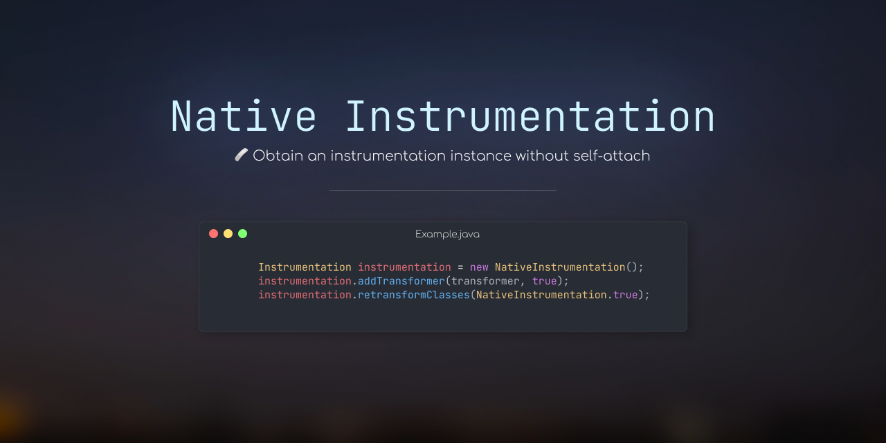

> ⚠️ This does not currently support Linux x86 32-bit, Linux ARM, Windows x86 32-bit or Windows ARM, because neither we nor GitHub Actions 
> have a machine to build them. But ideally, the source code should still work

### Usage
The `NativeInstrumentation` class provided in this library simply
implements `java.lang.instrument.Instrumentation`, so most existing code that
uses Instrumentation can work out of the box.

"Most", because class retransform is always enabled, there's no way
to set `Can-Retransform-Classes` or `Can-Redefine-Classes` to false.


Another usage is to use it as `Unsafe`, you can invoke or call any method you want, even if it's an illegal 
reflection access. You can also set any fields, still, even if it's illegal reflection access, and,
you can also set a field to a value that it shouldn't be (i.e. set a String field to a File instance),
the JVM won't crash, but it will get confusing for sure. Feel free to poke around with it.


To create the instance of Instrumentation, do:

```java
Instrumentation instrumentation = new NativeInstrumentation();
```

To set fields, do

```java
NativeInstrumentation.setStaticField(...);
```

etc.

### Setup

Gradle (Kotlin)
```kotlin
repositories {
    maven("https://maven.pkg.github.com/fan87/NativeInstrumentation")
}

dependencies {
    implementation("me.fan87:native-instrumentation:1.0-SNAPSHOT")
    runtimeOnly("me.fan87:native-instrumentation-native:1.0-SNAPSHOT:linux-x86_64")
    runtimeOnly("me.fan87:native-instrumentation-native:1.0-SNAPSHOT:windows-x86_64")
}
```

```groovy
repositories {
    maven { url "https://maven.pkg.github.com/fan87/NativeInstrumentation" }
}

dependencies {
    implementation "me.fan87:native-instrumentation:1.0-SNAPSHOT"
    runtimeOnly "me.fan87:native-instrumentation-native:1.0-SNAPSHOT:linux-x86_64"
    runtimeOnly "me.fan87:native-instrumentation-native:1.0-SNAPSHOT:windows-x86_64"
}
```

Maven

```xml
<repositories>
    <repository>
        <id>native-instrumentation</id>
        <url>https://maven.pkg.github.com/fan87/NativeInstrumentation</url>
    </repository>
</repositories>

<dependencies>
    <dependency>
        <groupId>me.fan87</groupId>
        <artifactId>native-instrumentation</artifactId>
        <version>1.0-SNAPSHOT</version>
    </dependency>
    <dependency>
        <groupId>me.fan87</groupId>
        <artifactId>native-instrumentation-native</artifactId>
        <version>1.0-SNAPSHOT</version>
        <classifier>linux-x86_64</classifier>
        <scope>runtime</scope>
    </dependency>
    <dependency>
        <groupId>me.fan87</groupId>
        <artifactId>native-instrumentation-native</artifactId>
        <version>1.0-SNAPSHOT</version>
        <classifier>windows-x86_64</classifier>
        <scope>runtime</scope>
    </dependency>
</dependencies>
```